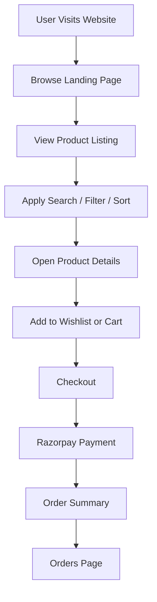
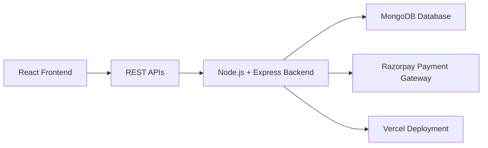

<div align="center">

# 📚 Shelfify

### A Full Stack MERN E-Commerce Book Store

**Shelfify** is a modern book shopping platform with authentication, product filtering, wishlist, cart, Razorpay payment integration, order management, and responsive UI.

<br/>


<br/>
<br/>

<a href="#">
  
</a>
<a href="#">
  
</a>
<a href="https://github.com/Utkarsh5100">
  
</a>

</div>

---

## 🧠 About The Project

**Shelfify** is a complete full-stack e-commerce application built for buying books online.
It includes core e-commerce features like user authentication, product listing, advanced filters, wishlist, cart, coupons, Razorpay checkout, order summary, and order history.

The project demonstrates practical implementation of:

<table>
<tr>
<td>✅ Full Stack Development</td>
<td>✅ REST API Integration</td>
</tr>
<tr>
<td>✅ Authentication Flow</td>
<td>✅ Payment Gateway Integration</td>
</tr>
<tr>
<td>✅ Cart & Wishlist Logic</td>
<td>✅ Product Filtering & Search</td>
</tr>
<tr>
<td>✅ Responsive UI</td>
<td>✅ Backend Deployment</td>
</tr>
</table>

---

## 🔗 Project Links

| Type                  | Link                       |
| --------------------- | -------------------------- |
| 🌐 Frontend Live Demo | `Add Frontend Link Here`   |
| ⚙️ Backend API        | `Add Backend Link Here`    |
| 💻 GitHub Repository  | `Add Repository Link Here` |

---

## 🛠️ Tech Stack

<div align="center">

### Frontend

<a href="https://developer.mozilla.org/en-US/docs/Web/HTML">
  
</a>
<a href="https://developer.mozilla.org/en-US/docs/Web/CSS">
  
</a>
<a href="https://developer.mozilla.org/en-US/docs/Web/JavaScript">
  
</a>
<a href="https://react.dev/">
  
</a>

### Backend & Database

<a href="https://nodejs.org/">
  
</a>
<a href="https://expressjs.com/">
  
</a>
<a href="https://www.mongodb.com/">
  
</a>

### Tools & Deployment

<a href="https://git-scm.com/">
  
</a>
<a href="https://github.com/">
  
</a>
<a href="https://vercel.com/">
  
</a>
<a href="https://www.postman.com/">
  
</a>

</div>

---

## ✨ Features

<table>
<tr>
<td width="50%">

### 🔐 Authentication

* User Signup
* User Login
* User Logout
* Protected user flow

</td>
<td width="50%">

### 🏠 Landing Page

* Book categories
* New arrivals
* Clean navigation
* Responsive layout

</td>
</tr>

<tr>
<td width="50%">

### 📚 Product Listing

* Product listing page
* Single product page
* Search by book name
* Search by author name
* Pagination support

</td>
<td width="50%">

### 🎯 Sorting & Filtering

* Sort price low to high
* Sort price high to low
* Filter by price range
* Filter by genre
* Filter by rating
* Filter by stock availability
* Filter by fast delivery
* Clear all filters

</td>
</tr>

<tr>
<td width="50%">

### ❤️ Wishlist Management

* Add to wishlist
* Remove from wishlist
* Move item to cart

</td>
<td width="50%">

### 🛒 Cart Management

* Add to cart
* Update item quantity
* Remove from cart
* Move item to wishlist
* Apply coupon

</td>
</tr>

<tr>
<td width="50%">

### 💳 Payment

* Razorpay integration
* Secure checkout
* Order confirmation

</td>
<td width="50%">

### 📦 Orders

* Order summary
* Ordered items details
* Orders page

</td>
</tr>
</table>

---

## 🔔 Custom Toast Component

Shelfify includes a reusable toast notification system with four notification types:

| Type           | Purpose            |
| -------------- | ------------------ |
| ✅ Success      | Successful actions |
| ❌ Error        | Failed actions     |
| ⚠️ Warning     | User warnings      |
| ℹ️ Information | General updates    |

---

## 🌟 Project Highlights

* Built a complete **MERN stack e-commerce platform** with authentication, product browsing, wishlist, cart, checkout, and order management.

* Implemented **advanced filtering, sorting, search, and pagination** to improve user experience and product discovery.

* Integrated **Razorpay payment gateway** for real-world checkout functionality.

* Developed a scalable full-stack architecture using **React.js, Node.js, Express.js, MongoDB, and REST APIs**.

---

## 🧩 Application Flow



---

## 🏗️ Architecture



---

## 📁 Folder Structure

```bash
Shelfify/
│
├── frontend/
│   ├── public/
│   ├── src/
│   │   ├── components/
│   │   ├── pages/
│   │   ├── context/
│   │   ├── reducers/
│   │   ├── services/
│   │   ├── utils/
│   │   └── App.js
│   └── package.json
│
├── backend/
│   ├── config/
│   ├── controllers/
│   ├── models/
│   ├── routes/
│   ├── middleware/
│   ├── server.js
│   └── package.json
│
└── README.md
```

---

## ⚙️ Installation & Setup

### 1️⃣ Clone the Repository

```bash
git clone https://github.com/Utkarsh5100/Shelfify.git
```

### 2️⃣ Navigate to the Project

```bash
cd Shelfify
```

### 3️⃣ Install Frontend Dependencies

```bash
cd frontend
npm install
```

### 4️⃣ Run Frontend

```bash
npm start
```

### 5️⃣ Install Backend Dependencies

```bash
cd ../backend
npm install
```

### 6️⃣ Run Backend

```bash
npm run dev
```

---

## 🔐 Environment Variables

Create a `.env` file inside the backend folder:

```env
MONGO_URI=your_mongodb_connection_string
JWT_SECRET=your_jwt_secret_key
RAZORPAY_KEY_ID=your_razorpay_key_id
RAZORPAY_KEY_SECRET=your_razorpay_key_secret
```

---

## 🚀 Future Enhancements

* Admin dashboard for managing products and orders
* Product review and rating system
* Email confirmation after successful order
* Dark mode support
* Personalized book recommendations
* Improved coupon and discount management

---

## 👨‍💻 Author

<div align="center">

### Utkarsh Shukla

<a href="https://github.com/Utkarsh5100">
  
</a>
<a href="https://www.linkedin.com/in/utkarsh-shukla51">
  
</a>
<a href="https://leetcode.com/u/coder_utkarsh/">
  
</a>
<a href="https://www.hackerrank.com/profile/utkarshshukla511">
  
</a>
<a href="https://www.geeksforgeeks.org/profile/utkarshshprjn">
  
</a>

</div>

---

<div align="center">


</div>


